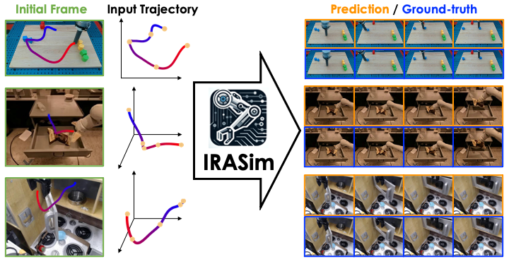

<h1 align="center">IRASim: Learning Interactive Real-Robot Action Simulators</h1>

[[Project page]](https://gen-irasim.github.io/)
[[Paper]](https://arxiv.org/pdf/2406.14540)

[Fangqi Zhu](https://fangqi-zhu.github.io/)<sup>1,2</sup>,
[Hongtao Wu](https://scholar.google.com/citations?user=7u0TYgIAAAAJ&hl=zh-CN&oi=ao)<sup>1&dagger;*</sup>,
[Song Guo](https://cse.hkust.edu.hk/~songguo/)<sup>2\*</sup>,
[Yuxiao Liu](https://scholar.google.com/citations?hl=zh-CN&user=i8wNtSgAAAAJ)<sup>1</sup>,
[Chilam Cheang](Gen-IRASim.github.io)<sup>1</sup>,
[Tao Kong](https://www.taokong.org/)<sup>1</sup>

<sup>1</sup>ByteDance Research,
<sup>2</sup>Hong Kong University of Science and Technology

*Corresponding authors
&dagger;Project Lead


https://github.com/user-attachments/assets/916034da-f0a7-40c2-8d98-c4c67760cf41


Scalable robot learning in the real world is limited by the cost and safety issues of real robots. In addition, rolling out robot trajectories in the real world can be time-consuming and labor-intensive. In this paper, we propose to learn an interactive real-robot action simulator as an alternative. We introduce a novel method, IRASim, which leverages the power of generative models to generate extremely realistic videos of a robot arm that executes a given action trajectory, starting from an initial given frame. To validate the effectiveness of our method, we create a new benchmark, IRASim Benchmark, based on three real-robot datasets and perform extensive experiments on the benchmark. Results show that IRASim outperforms all the baseline methods and is more preferable in human evaluations. We hope that IRASim can serve as an effective and scalable approach to enhance robot learning in the real world. To promote research for generative real-robot action simulators, we open-source code, benchmark, and checkpoints.



## Installation

To set up the environment, run the following command:
```bash
bash scripts/install.sh
```

## Dataset

To download the complete dataset, run:
```
bash scripts/download.sh
```

This table lists the download links and file sizes for the RT-1, Bridge, and Language-Table datasets, categorized into train, evaluation, and checkpoints data.

| Category        | Train                                                                                              | Size  | Evaluation                                                             | Size  | Checkpoints                                                            | Size  |
|:----------------|:---------------------------------------------------------------------------------------------------|:------|:----------------------------------------------------------------------|:------|:-----------------------------------------------------------------------|:------|
| **RT-1**        | [rt1_train_data.tar.gz](https://lf-robot-opensource.bytetos.com/obj/lab-robot-public/opensource_IRASim_v1/rt1_train_data.tar.gz)                       | 86G   | [rt1_evaluation_data.tar.gz](https://lf-robot-opensource.bytetos.com/obj/lab-robot-public/opensource_IRASim_v1/rt1_evaluation_data.tar.gz)             | 100G  | [rt1_checkpoints_data.tar.gz](https://lf-robot-opensource.bytetos.com/obj/lab-robot-public/opensource_IRASim_v1/rt1_checkpoints_data.tar.gz)           | 29G   |
| **Bridge**      | [bridge_train_data.tar.gz](https://lf-robot-opensource.bytetos.com/obj/lab-robot-public/opensource_IRASim_v1/bridge_train_data.tar.gz)                 | 31G   | [bridge_evaluation_data.tar.gz](https://lf-robot-opensource.bytetos.com/obj/lab-robot-public/opensource_IRASim_v1/bridge_evaluation_data.tar.gz)       | 63G   | [bridge_checkpoints_data.tar.gz](https://lf-robot-opensource.bytetos.com/obj/lab-robot-public/opensource_IRASim_v1/bridge_checkpoints_data.tar.gz)     | 32G   |
| **Language-Table** | [languagetable_train_data.tar.gz](https://lf-robot-opensource.bytetos.com/obj/lab-robot-public/opensource_IRASim_v1/languagetable_train_data.tar.gz)  | 200G  | [languagetable_evaluation_data.tar.gz](https://lf-robot-opensource.bytetos.com/obj/lab-robot-public/opensource_IRASim_v1/languagetable_evaluation_data.tar.gz) | 194G  | [languagetable_checkpoints_data.tar.gz](https://lf-robot-opensource.bytetos.com/obj/lab-robot-public/opensource_IRASim_v1/languagetable_checkpoints_data.tar.gz) | 34G   |

The complete dataset structure can be found in [dataset_structure.txt](https://github.com/bytedance/IRASim/blob/main/dataset_structure.txt).

## Language Table Application

We recommend starting with the Language Table application. This application provides a user-friendly keyboard interface to control the robotic arm in an initial image on a 2D plane:

```bash
python3 application/languagetable.py
```

## Training

Below are example scripts for training the IRASim-Frame-Ada model on the RT-1 dataset.

To accelerate training, we recommend encoding videos into latent videos first. Our code also supports direct training by setting `pre_encode` to `false`.

### Single GPU Training
```bash
python3 main.py --config configs/train/rt1/frame_ada.yaml
```

### Multi-GPU Training on a Single Machine
```bash
torchrun --nproc_per_node 8 --nnodes 1 --node_rank 0 --rdzv_endpoint {node_address}:{port} --rdzv_id 107 --rdzv_backend c10d main.py --config configs/train/rt1/frame_ada.yaml
```

## Evaluation

Below are example scripts for evaluating the IRASim-Frame-Ada model on the RT-1 dataset.

### Short Trajectory Setting

To quantitatively evaluate the model in the short trajectory setting, we first need to generate all evaluation videos.

Generate evaluation videos:
```bash
torchrun --nproc_per_node 8 --nnodes 1 --node_rank 0 --rdzv_endpoint {node_address}:{port} --rdzv_id 107 --rdzv_backend c10d main.py --config configs/evaluation/rt1/frame_ada.yaml
```

We provide an automated script to calculate the metrics of the generated short videos:
```bash
python3 evaluate/evaluation_short_script.py
```

### Long Trajectory Setting

Generate all long videos in an autoregressive manner.

   Generate the scripts for generating long videos in a multi-process manner:
   ```bash
   python3 scripts/generate_command.py
   ```

   Run:
   ```bash
   bash scripts/generate_long_video_rt1_frame_ada.sh
   ```

Use the automated script to calculate the metrics of the generated long videos:
   ```bash
   python3 evaluate/evaluation_long_script.py
   ```

## Citation
If you find this code useful in your work, please consider citing
```shell
@article{FangqiIRASim2024,
  title={IRASim: Learning Interactive Real-Robot Action Simulators},
  author={Fangqi Zhu and Hongtao Wu and Song Guo and Yuxiao Liu and Chilam Cheang and Tao Kong},
  year={2024},
  journal={arXiv:2406.12802}
}
```

## Acknowledgement
* Our implementation is largely adapted from [Latte](https://github.com/Vchitect/Latte).
* Our FVD implementation is adapted from [stylegan-v](https://github.com/universome/stylegan-v).
* Our FID implementation is adapted from [pytorch-fid](https://github.com/mseitzer/pytorch-fid).
* Our RT-1, Bridge, Language-Table datasets are adapted from [RT-1](https://robotics-transformer1.github.io/), [Bridge](https://rail-berkeley.github.io/bridgedata/), [open_x_embodiment
](https://github.com/google-deepmind/open_x_embodiment).

# Discussion Group

If you have any questions during the trial, running or deployment, feel free to join our WeChat group discussion! If you have any ideas or suggestions for the project, you are also welcome to join our WeChat group discussion!


